# Overview
 - Retrieval Augmented Generation
 - Use of RAG based LLMs to get Better Responses
 - Semantic Search for User Queries

# Retrieval Augmented Generation 
 - RAG allows LLMs to handle a broader range of queries without the need of exponentially large training data set.
 - RAG can be thought of as an architect and interior designer working together. The architect gather the important data
and the interior designer add style to the inside of the house.
 - Retrieval job is to find relevant and right information, and generation component generates coherent and engaging 
responses.
 - LLMs generally relies on the data that they were trained on and this data might be outdated. LLMs also falls short in
tasks requiring specific information
 - RAG addresses this by retrieving information from standard sources
 - Retrieval Augmented Generation (RAG) is a method for generating text using additional information fetched from an 
external data source.
 - RAG models retrieve documents and pass them to a seq2seq model. 

#### RAG Framework

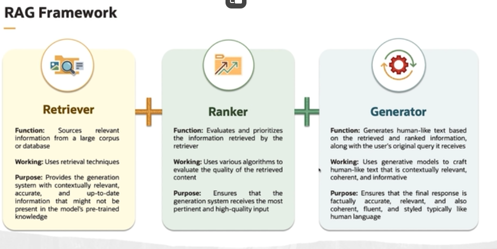

##### Retriever
 - Function -> Sources relevant information from a large corpus or database.
 - Working -> Uses retrieval techniques
 - Purpose -> Provides the generation system with contextually relevant, accurate and up-to-date information that might 
not be present in the model's pre-trained knowledge

##### Ranker
 - Functions -> Evaluates and prioritizes the information retrieved by the retriever.
 - Working -> Uses various algorithms to evaluate the quality of the retrieved content.
 - Purpose -> Ensure that the generation system receives the most pertinent and high-quality input.

##### Generator
 - Function -> Generates human-like text based on the retrieved and ranked information, along with the user's original
query it receives.
 - Working -> Uses generative models to craft human-like text that is contextually relevant, coherent and informative
 - Purpose -> Ensures that the final response is factually accurate, relevant, and also coherent, fluent, and styled 
typically like human language.

### RAG techniques

#### RAG Techniques
#### RAG Sequence
 - For each input query(like a chapter topic), the model retrieves a set of relevant documents or information
 - If then considers all these documents together to generate a single, cohesive response(the entire chapter) that reflects
the combined information.
 - This technique look at the entire document at once and then forms the answer.
 - It synthesizes a holistic response from a batch of information
 - It should be adopted when the task requires more holistic and unified approach and response requiring thematic and
contextual consistency across the entire text.

#### RAG Token
 - For each part of the response(like each sentence or even each word), the model retrieves relevant documents.
 - The response is constructed incrementally, with each part reflecting the information from the documents retrieved for
that specific part.
 - This technique looks at the document step-by-step at a granular level.
 - It constructs the response in a more piece-meal fashion, considering different sources for different part of response
 - Use RAG token when the task requires integrating highly varied and specific information from multiple sources into
different part of response.

### RAG Pipeline
 - The RAG architecture combines the retrieval based model with a generation based model to enhance the text generated.
 - The first phase is ingestion, where documents are ingested into system
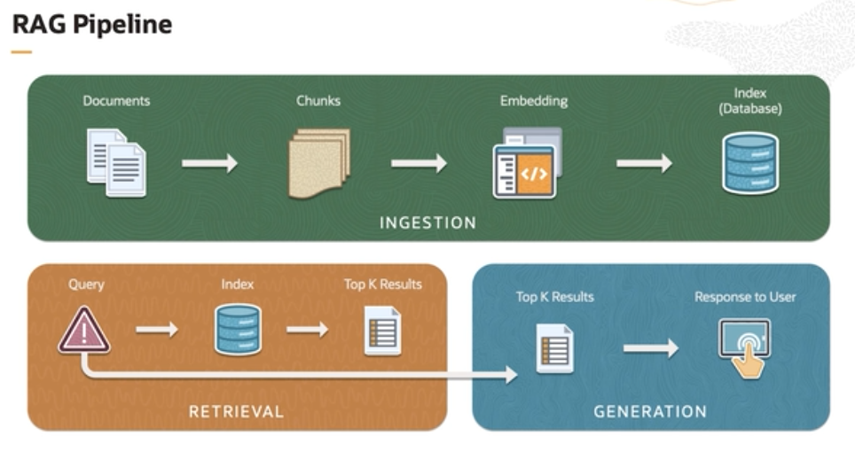

### RAG Application
 - RAG Applications works by using the prompt with the chat history called the enhanced prompt and is fed into the embedding
model to do a similarity search into the db, maybe fetching private information from db, and then generates the information
enhanced prompt called Augmented Prompt which is fed into the LLM to get Highly Accurate Response.
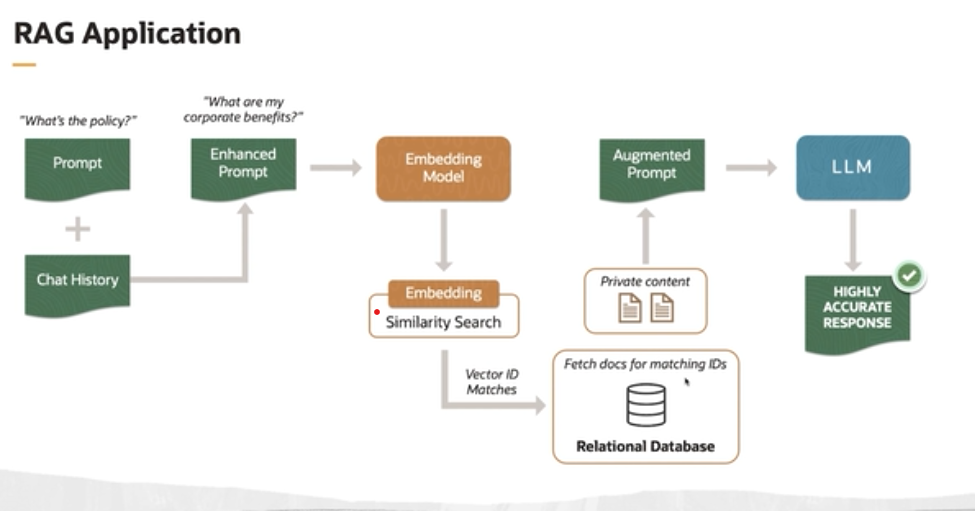

### RAG Evaluation
 - Although RAG has the most updated information, yet hallucinations can't be avoided.
 - The Retrieval could fail to retrieve the sufficient context or get the relevant one.
 - The generated response could be mostly influenced by the LLM training data and not the retrieved document.
 - Maybe every process works out fine yet the response fails to address user's query.
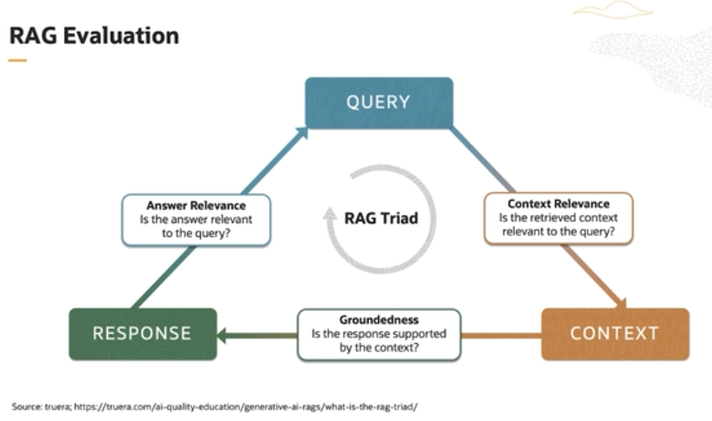
 - By minimising the above 3 parameters, the RAG application can minimise hallucinations

## Vector Databases
 - RAG LLMs uses vector databases to enhance the accuracy of the output
 - The structure of vector database is different from the traditional relational db.
 - Optimized for multidimensional spaces where the relationship is based on distances and similarities in a high-dimensional
vector space.
 - This db is adept in searching the meaning and nearest similar word in the search space.
 - Many of these db uses a distributed architecture to handle the memory and computation requirements.
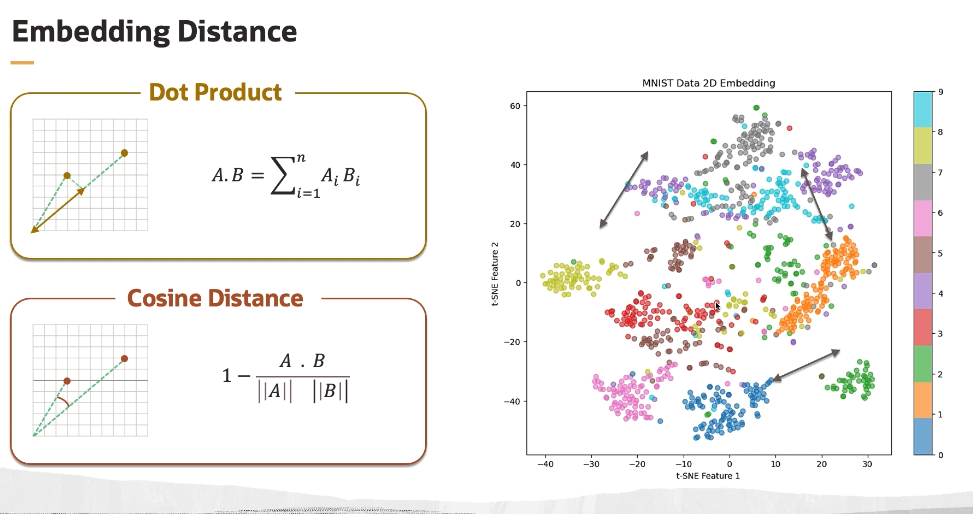

#### LLMs vs LLMs without RAG
 - LLMs without RAG doesn't use vector databases, rather uses pre-trained corpus of data. It may or may not use Fine-tuning
 - Vector Databases are core-component of the RAG based LLMs.
 - Vector Databases are optimized for storing and operating on vectors than the row-based data
 - Even search engines uses vector space models for text document for similarity searches and ranking
 - E-commerce websites uses vector dbs for recommending similar items to users. They're also used in computer vision,
bio-information and anomaly detection
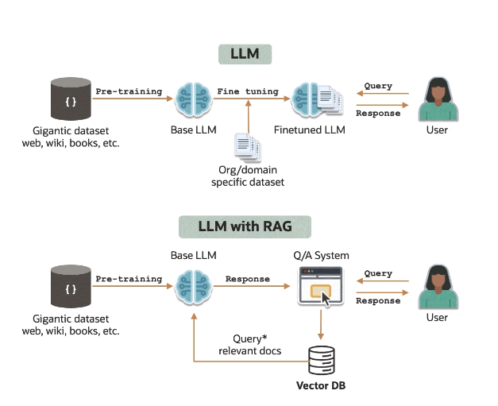

#### Vectors
 - A vector is a sequence of numbers called dimensions, used to capture the important "feature" of the data
 - Embeddings in LLMs are essentially high-dimensional vectors
 - Vectors are generated using deep learning embedding model and represent the semantic context of data, not the underlying
words or pixel.

##### Similar Vectors
 - k-nearest neighbours algorithm can be used to perform a vector or semantic search to obtain the nearest vector in embedding
space to a query vector.
 - The distances between all the vectors and the query vectors are calculated, and then those distances are sorted, and
then top k best matching objects with the best distance is returned. 
 - But this algorithm is not feasible in real life due to high cost of computation required.
 - And due to this reason, ANN algorithms are used, which kind of trade accuracy with speed of computation.
 - ANN algorithms are designed to find near-optimal neighbours much faster than exact KNN searches
 - ANN methods such as HNSW, FAISS, Annoy are often preferred for large-scale similarity search tasks in embedding spaces
due to their efficiency.
 - The choice of the algorithm depends on several factors
   1. Size of the dataset
   2. Dimensionality of the vectors
   3. Balance between Accuracy vs speed
 - In real world application, it's common to start from ANN libraries like FAISS from meta, Annoy from spotify.

#### Vector Database Workflow
 - Vectors represent the dataset of high dimensional vectors that needs to be stored and queried which was generated by some NLP.
 - These vectors could be embeddings of text, image, music etc and they encapsulate rich context aware information about the data.
 - The second step is indexing, where the vector is mapped to a data structure for faster searching
 - Indexing organises the vector in a way that allows for efficient retrieval.
 - This is often done using data structure designed for high dimensional spaces such as tree structure or approximate methods
to facilitate faster search at the cost of accuracy.
 - After Indexing, these vectors are stored in vector DB. A vector DB is organised to manage high dimensional data enabling
efficient search, storage and retrieval operations.
 - Querying is the step, where the similar searches to the given query is found and is either returned or put into 
post-processing.
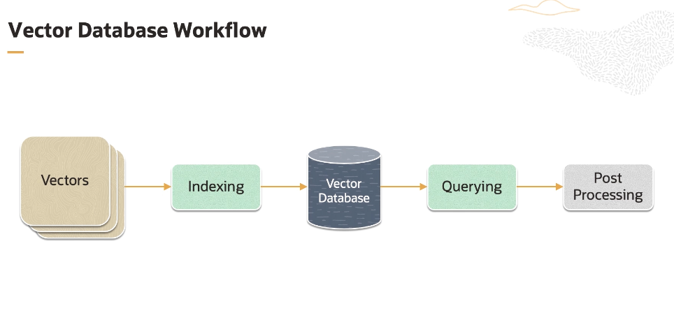
 - Vector databases features :
   1. Better Accuracy 
   2. Lower Latency
   3. Parallel processing enabled
   4. Scalability

#### Role of vector Databases with LLMs
 - Address the hallucination (i.e., inaccuracy) problem inherent in LLM responses.
 - Augment prompt with enterprise-specific content to produce better responses.
 - Avoid exceeding LLM token limits by using most relevant content.
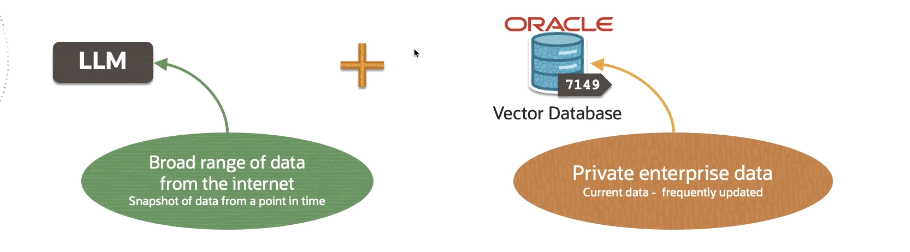

#### Role of vector database with LLMs
 - Cheaper than fine-tuning LLMs, which can be expensive to update.
 - Real-time updated knowledge base
 - Cache previous LLM prompts/responses to improve performance and reduce costs.

### Keyword Search
 - Keywords are words used to match with the terms people are searching for, when looking for products, services or general information
 - Simplest form of search based on exact matches of the user-provided keywords in the database or index.
 - Evaluates document based on the presence and frequency of the query term. For example, BM25 is such an algorithm.
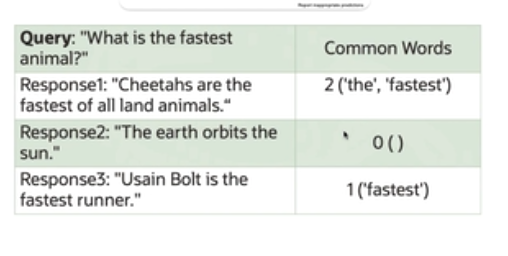

#### Semantic Search
 - With semantic search, LLMs can understand the context of the user input to give more accurate responses.
 - Search by meaning -> Retrieval is done by understanding intent and context, rather than matching keywords
 - Ways to do this :
   1. Dense Retrieval : Uses text embeddings in order to search documents relevant to query. 
   2. Reranking : Assigns a relevance score. This process takes a set of items like search results, documents, images etc
and reorders them to improve the relevance in order to improve the quality of result.
 - Embeddings represent the meaning of text as a list of numbers
 - Capture the essence of the data in a lower-dimensional space while maintaining the semantic relationships and meaning

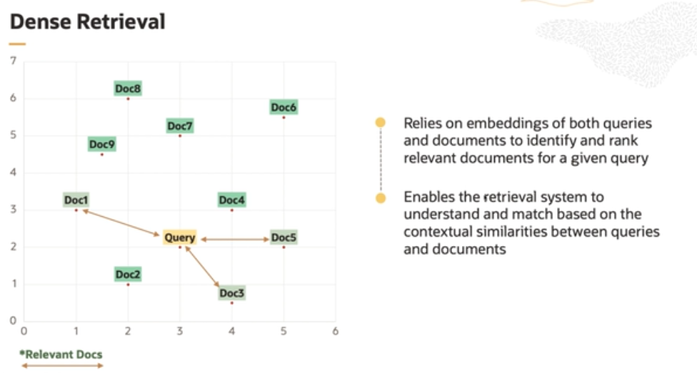
##### Dense Retrieval
 - Relies on embeddings of both queries and documents to identify and rank relevant documents for a given query
 - Enables the retrieval system to understand and match based on the contextual similarities between queries and documents.

##### Reranking
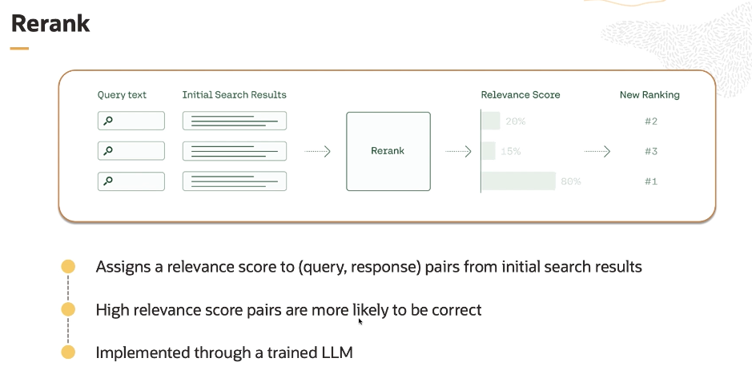
 - Here the results are already ranked by some basic ranking algorithms and then it is further re-ranked to assign a relevant score
to each response pairs.
 - It works by training the model to ranks positive answers more and negative answers less.

##### Hybrid Search
 - This method combines the techniques of keyword search for its specificity and semantic search for its relevance.
 - -> Sparse + Dense
 - Hybrid search combines the precision of keyword search for searching the relevant documents from a large corpus of documents
to narrow down the search result and then in this subset apply dense retrieval

## Extending Chatbot by adding Memory

### LangChain Memory
 - Ability to store information about past interactions is "memory"
 - Chain interacts with the memory twice in a run.
   1. Read from memory -> After user input but before chain execution
   2. Write to memory -> After core logic but before output
 - Various types of memory are available in LangChain
 - Data Structures and algorithms built on top of chat messages decide what is returned from the memory, e.g. memory might
return a succinct summary of the past K messages.

### Demo: Memory
